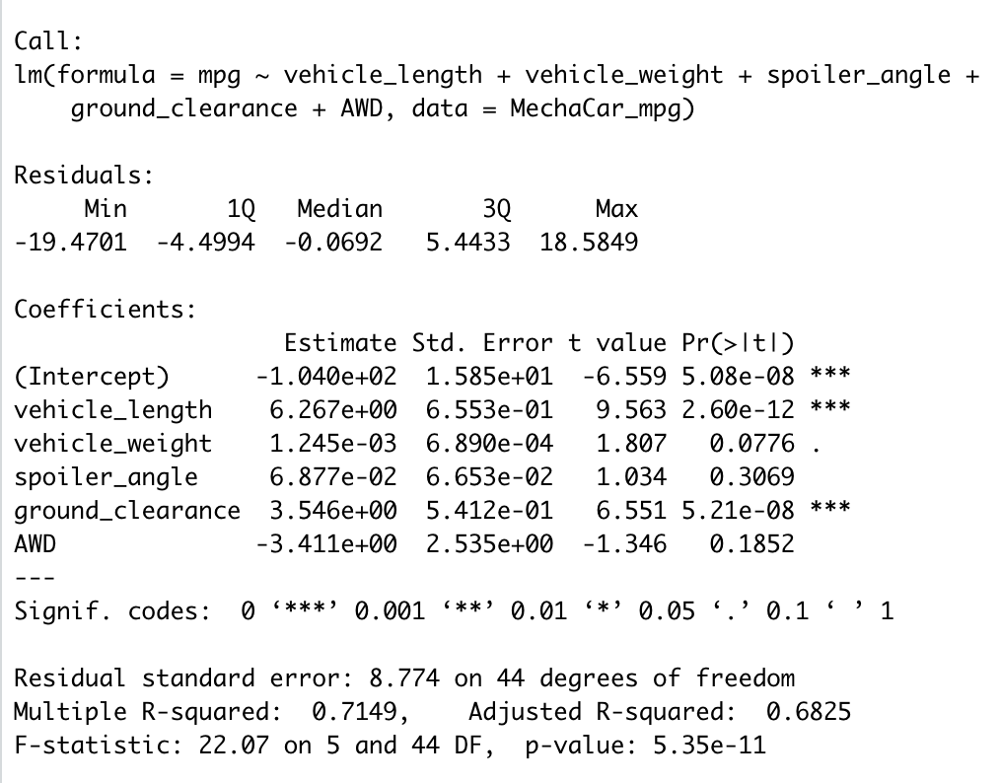
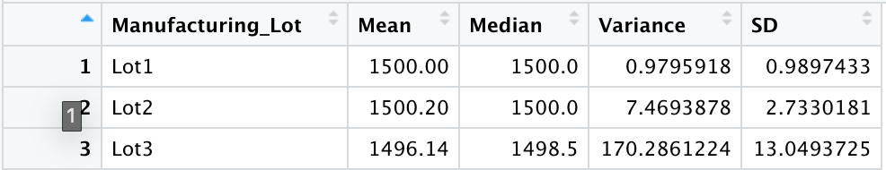
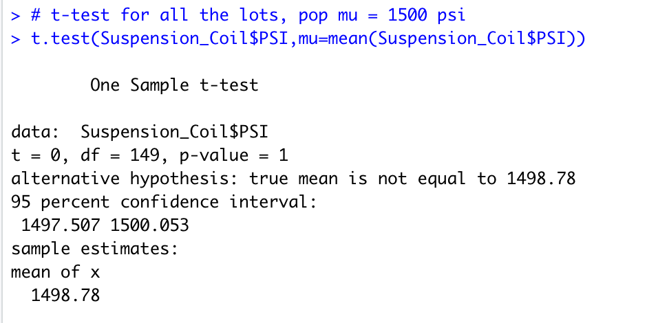
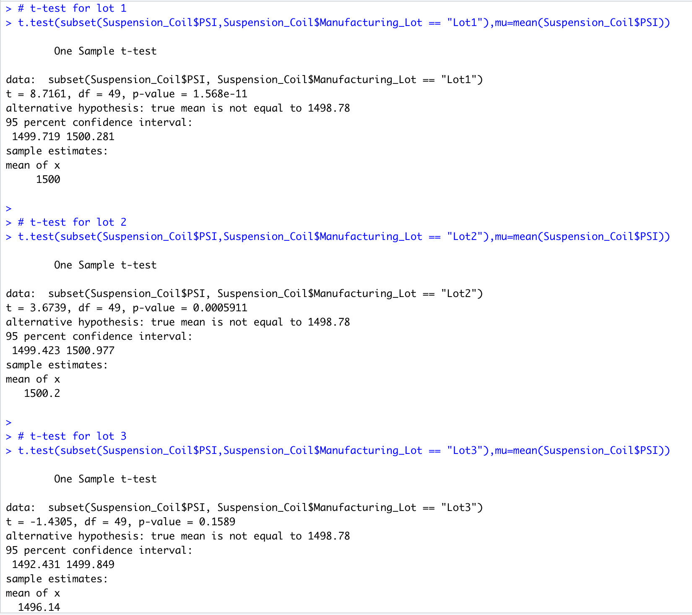

# MechaCar_Statistical_Analysis

# Deliverable 1:  
## Linear Regression to Predict MPG
**Resulting Model:** 
				

**Statistical Summary:** 
<p align="center">  

</p>

From the above output we can see that:

1. The **vehicle length**, and **vehicle ground clearance** hold a significant impact on miles per gallon on the MechaCar prototype. Conversely,
the **vehicle weight**, **spoiler angle**, and **All Wheel Drive** (AWD) have p-Values that indicate a random amount of variance with the dataset i.e. they are not statistically significant.  

2. The p-Value for this model, ```p-Value: 5.35e-11```, is much smaller than the assumed significance level of 0.05. This indicates there is sufficient evidence to **reject our null hypothesis**.


3.  This linear model has an r-squared value of 0.7149, which means that approximately 71.49% of all mpg predictions will be determined by this model. Relatively speaking, his multiple regression model **does predict mpg of MechaCar prototypes effectively**.

# Deliverable 2:  
## Summary Statistics on Suspension Coils

First looking at all manufacturing lots:

<p align="center">  

</p>

Diving a little deeper into each of the 3 lots:

<p align="center">  

</p>

With the understanding that the design specifications for the MechaCar suspension coils mandate that <mark style="background-color: Yellow">**the variance of the suspension coils cannot exceed 100 pounds per square inch (PSI)**</mark>.

When looking at the entire population of the production lot, the variance of the coils is 62.29 PSI, which is well within the 100 PSI variance requirement.  

Similarly, but significantly more consistent, Lot 1 and Lot 2 are well within the 100 PSI variance requirement; with variances of 0.98 and 7.47 respectively.  However, it is Lot 3 that is showing much larger variance in performance and consistency, with a variance of 170.29.  It is Lot 3 that is disproportionately causing the variance at the full lot level

# Deliverable 3:  
## t-Tests on Suspension Coils

The next step is to conduct a t-test on the suspension coil data to determine whether there is a statistical difference between the mean of this provided sample dataset and a hypothesized, potential population dataset. Using the presumed **population mean of 1500**, we find the following:

There is a summary of the t-test results across **all manufacturing lots**
<p align="center">  

</p>

From here we can see the **true mean of the sample is 1498.78**, which we also saw in the summary statistics above.  With a **p-Value of 0.06**, which is higher than the common significance level of 0.05, there is **NOT enough evidence to support rejecting the null hypothesis**.  That is to say, the mean of all three of these manufacturing lots is statistically similar to the presumed population mean of 1500. 

**Next looking at each individual lots:**

1. Lot 1 sample actually has the **true sample mean of 1500**, again as we saw in the summary statistics above. With a **p-Value of 1**, clearly we cannot reject (i.e. accept) the null hypothesis that there is no statistical difference between the observed sample mean and the presumed population mean (1500).
2. Lot 2 has essentially the same outcome with a **sample mean of 1500.02**, a **p-Value of 0.61**; the null hypothesis cannot be rejected, and the sample mean and the population mean of 1500 are statistically similar.
3. However, Lot 3, not surprisingly is a different scenario. Here **the sample mean is 1496.14** and the **p-Value is 0.04**, which is lower than the common significance level of 0.05.  All indicating to **reject the null hypothesis** that this sample mean and the presumed population mean are not statistically different.

<p align="center">  

</p>

How does this information help?  Clearly, something went awry in Lot 3's production cycle. The process needs to be checked for system fails and the suspension coils from this lot need to be inspected to remove those not meeting quality criteria.

# Deliverable 4:  
## Study Design: MechaCar vs Competition

The following outlines a statistical study to compare the MechaCar to the competition. Below are explained the metrics to measure, the hypothesis, the test to use, and the data needed.

### 1. What metric or metrics are you going to test?

In order to analysis the MechaCar’s performance against the competition, I will measure the following three metrics:
-	Cost
-	Fuel efficiency
-	Safety rating

These three metrics are often considered by consumers when purchasing a car. Cost is often the No.1 factor, as most people would set a budget before browsing options and compare options based on cost. Furthermore, fel efficiency is another important variable that has to be taken into account as it is important to understand the estimated cost of operating the vehicle, a higher fuel efficiency can be a better option even when cost of the vehicle is higher. Finally, safety rating is also considered within the experiment, Vehicles with high safety ratings generally have enhaced safety features such as more airbags, loweer centre of gravity, etc. and is then assigned a saftey score by a governing body.


### 2. What is the null hypothesis or alternative hypothesis?

**Cost:**

_Null Hypothesis:_ The mean cost of all vehicles in this class are equal.

_Alternative Hypothesis:_ At least one of the vehicles in this class has a different mean cost than other vehicles.

**Fuel efficiency:**

_Null Hypothesis:_ The mean of fuel efficiency (measured in mpg) of all vehicles in this class are equal.

_Alternative Hypothesis:_ At least one of the vehicles in this class has a different mean of fuel efficiency than other vehicles.

**Safety rating:**

_Null Hypothesis:_ The mean of safety ratings of all vehicles in this class are equal.

_Alternative Hypothesis:_ At least one of the vehicles in this class has a different mean of safety rating than other vehicles.

### 3. What statistical test would you use to test the hypothesis? And why?

The use of an ANOVA test for this study would be appropriate as it can be used to compare the means of a continuous numerical variable across multiple groups.

**Cost and Saftey Rating**

One-Way ANOVA test. This test will be used to test the mean cost of MechaCar with multiple other competition vehicles’ mean cost's and safety ratings in the same class. 

**Fuel efficiency:**

Two-Way ANOVA test. This test will be used to test the mean of fuel efficiency of MechaCar with multiple other competition vehicles’ mean fuel efficiency in the same class. In addition, I want to test for two different independent variables: the fuel efficiency in city and on highway. 


### 4. What data is needed to run the statistical test?

I would need a sample size of MechaCars (preferably the larger the sample size the better according to the law of large numbers), the same amount of each other 4 competition vehicles in the same class, to be able to provide an unbiased test. Data on these cars would have to be provided or obtained from the manufacturer (MRSP for cost, and in house testing for feul effciency and safety should be conducted as tests preformed are usually under ideal conditions... that is ideal for the manufacturer and not necisarily indicative of real life).
